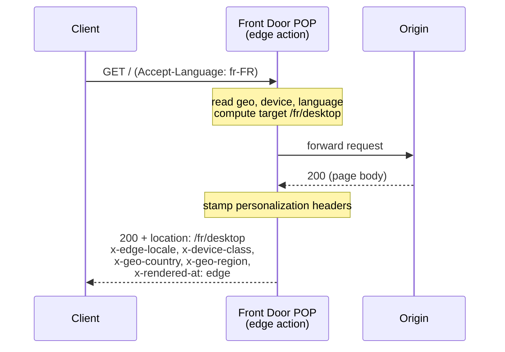

# SSR at the edge

An [Azure Front Door Edge Actions](https://learn.microsoft.com/azure/frontdoor/)
sample that personalizes the landing page at the edge. For each visitor it reads
**geo, device, and language**, computes a localized target (e.g. `/fr/mobile`),
and stamps it back as response headers.



## How it works

On `/` or `/index.html` the [handler](./src/edge_action.js):

1. Reads country (`context.country_code`), device (`context.is_mobile`) and
   language (`Accept-Language`).
2. Builds the localized, device-specific path and sets it as `location`.
3. Adds `x-edge-locale`, `x-device-class`, `x-geo-country`, `x-geo-region`,
   `x-rendered-at` for observability.

Other paths pass through untouched.

> **Note on behavior.** The edge data plane applies header changes but does not
> honor `response_code`, so the response stays `200` and the computed target
> rides along as a `location` header (a signal, not a real `302`). Writing
> `response.body` is unsupported and discards the edge action's output — so this
> is a personalization router, not full server-side rendering.

### Why not full SSR at the edge?

Rendering HTML in the edge action and returning it via `response.body` was
tested against a live Azure Front Door endpoint. AFD **discards the entire edge
action output** when a body is written and serves the origin response instead
(clean passthrough, no edge headers). AFD Edge Actions support header
manipulation, status codes, redirects and request blocking — not response-body
synthesis, so true SSR at the edge is not currently possible. For edge-side
HTML generation you would pair this router with an origin renderer (Azure
Functions, Static Web Apps, or App Service).

## Deploy

```bash
az login --tenant caglobaldemos2608.onmicrosoft.com
az extension add --name edge-action --upgrade
az extension add --name cdn --upgrade
```

**macOS / Linux:**

```bash
./infra/deploy.sh
```

**Windows (PowerShell):**

```powershell
./infra/deploy.ps1 -ResourceGroup myResourceGroup
```

Both scripts provision the edge action, the Front Door front end, and the
`EdgeAction` delivery rule that binds them. Edge propagation takes ~10–20 min.
Override defaults with environment variables (`deploy.sh`) or parameters
(`deploy.ps1`, e.g. `-EdgeActionName`, `-SubscriptionId`).

## Verify

```bash
HOST=$(az afd endpoint show -g rg-wachegha-edge-action-release \
  --profile-name ssrDemoAfd --endpoint-name ssrdemo --query hostName -o tsv)

curl -sD - -o /dev/null -H 'Accept-Language: fr-FR' "https://$HOST/" \
  | grep -iE 'location|x-rendered-at|x-geo-country|x-device-class|x-edge-locale'
```

Expect `x-rendered-at: edge` and a `location` such as `/fr/desktop`,
`/es/desktop`, or `/en/mobile`.

## Test locally

```bash
cd src
node -e 'const fs=require("fs");
const fn=new Function("console",fs.readFileSync("edge_action.js","utf8")+"\nreturn handler;")(console);
console.log(JSON.stringify(fn(JSON.parse(fs.readFileSync("test_input.json"))).response,null,2));'
```

The golden input (FR mobile) returns `location: /fr/mobile`. See
[`src/test_expected.json`](./src/test_expected.json).

## Files

| File | Purpose |
| --- | --- |
| `src/edge_action.js` | The handler deployed to the edge |
| `infra/deploy.sh` | Provision + bind everything (macOS/Linux) |
| `infra/deploy.ps1` | Provision + bind everything (Windows/PowerShell) |
| `src/test_input.json` / `src/test_expected.json` | Golden local test |
| `src/edge_actions.d.ts` | Generated type definitions |
